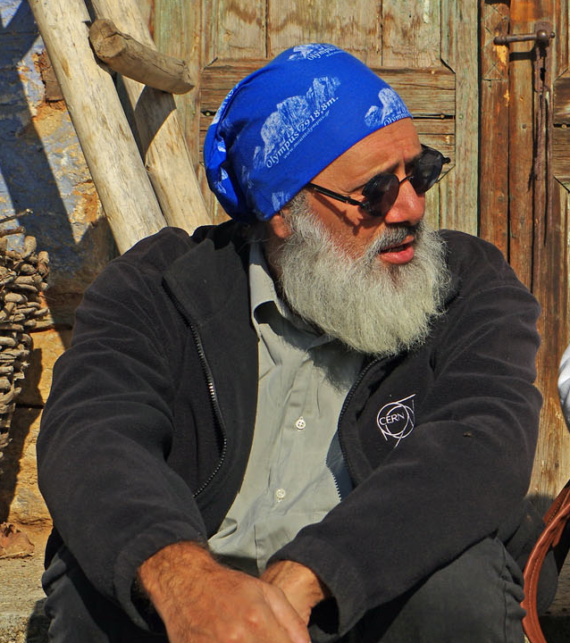



**Introduction**

“I hope that in this year to come, you make mistakes.
Because if you are making mistakes, then you are making new things, trying new things, learning, living, pushing yourself, changing yourself, changing your world. You're doing things you've never done before, and more importantly, you're Doing Something.
So that's my wish for you, and all of us, and my wish for myself. Make New Mistakes. Make glorious, amazing mistakes. Make mistakes nobody's ever made before. Don't freeze, don't stop, don't worry that it isn't good enough, or it isn't perfect, whatever it is: art, or love, or work or family or life.
Whatever it is you're scared of doing, Do it.
Make your mistakes, next year and forever.” 
`― Neil Gaiman`

<html>
<head>
<meta name="viewport" content="width=device-width, initial-scale=1">

</head>
<body>

<h1>Splendide mendax</h1>
<h3>Είμαστε αυτό που κάνουμε</h3>

  

    

      
    

    

      <h1>Παναγιώτης Πετρίδης</h1> 
      
there are no mistakes only lessons
 
      
growth is a process of trial and error

    

  

</body>
</html>

 <h3> για να αλλάξουμε αυτό που είμαστε! </h3>

<ul class="posts">
  
    <li>{{ post.date | date_to_string }} &raquo; <a href="{{ BASE_PATH }}{{ post.url }}">{{ post.title }}</a></li>
  
</ul>

